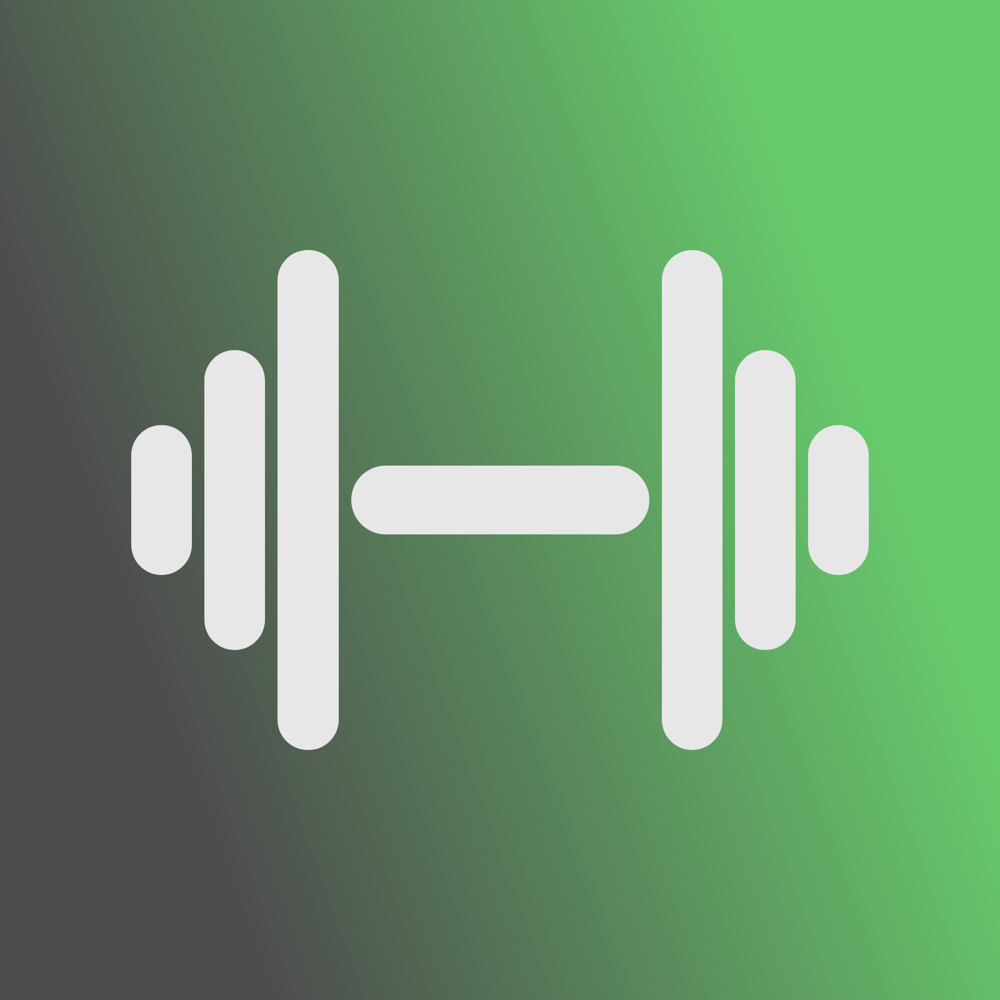
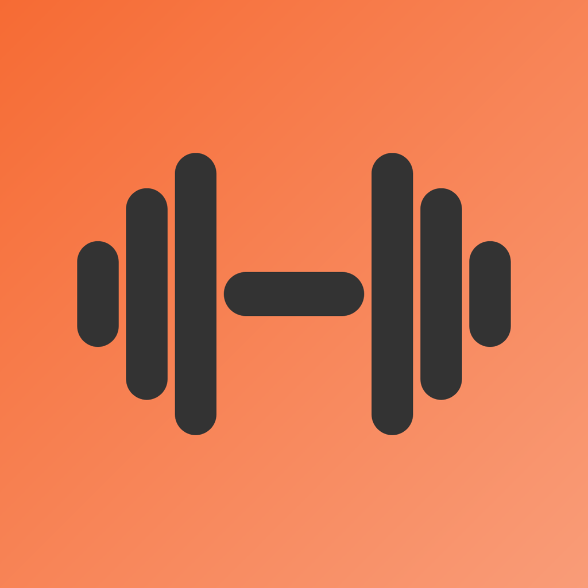
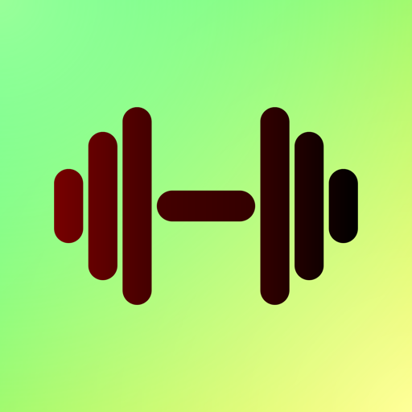
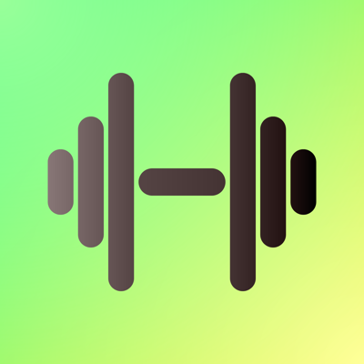
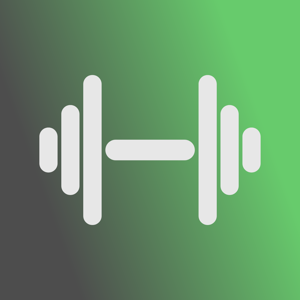
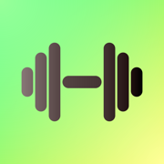

# Dambel - Logo
This is the initial version of the **Dambel** logo.

It may seem unusual, but it was designed using **HTML and CSS** to keep it super minimalistic and simple. You can extract the image by simply taking a screenshot of the specific `<div>` element in the browser.

## Code Usage

To work with and generate different sizes of the Dambel logo, follow these steps:

1. **Install requirements**:
   ```shell
   $ python3 -m venv .venv
   $ source .venv/bin/activate
   $ pip install -r requirements.txt
   ```

2. **Edit the Logo Design**:
   - Open [`logo.html`](logo.html) and modify the design of the logo if needed.

3. **Generate main PNG**:
   - Open the `logo.html` file in your browser.
   - Click the **Genearte PNG button** and `main.png` will be downloaded
   - Copy it into `files/main.png` in this repository

4. **Generate Different Sizes**:
   - Run the script to automatically generate all the necessary logo files and sizes:
     ```bash
     python3 generate.py
     ```

5. **Generated Images**:
   - The generated images will be saved into the [`files/`](files/) directory.

6. **Auto-Generated Images List**:
   - The list of images below is automatically generated by the script when you run it.

## Images

### 1600x1600
The biggest version available



### 1024x1024
High resolution for website headers, print, or large displays



### 512x512
For use in app stores (e.g., Apple App Store, Google Play Store)



### 400x400
Medium size for social media profile images (Facebook, Twitter, etc.)



### 300x300
Medium-sized logo for email signatures or smaller sections of website



### 180x180
Icons for mobile apps or small website icons



### 120x120
Smaller app icons (used on mobile or desktop apps)


### 60x60
Favicons or small logo images on social media profiles


### 30x30
Very small logo for favicon, small icons, or toolbar logos


### 16x16
Best for favicon


